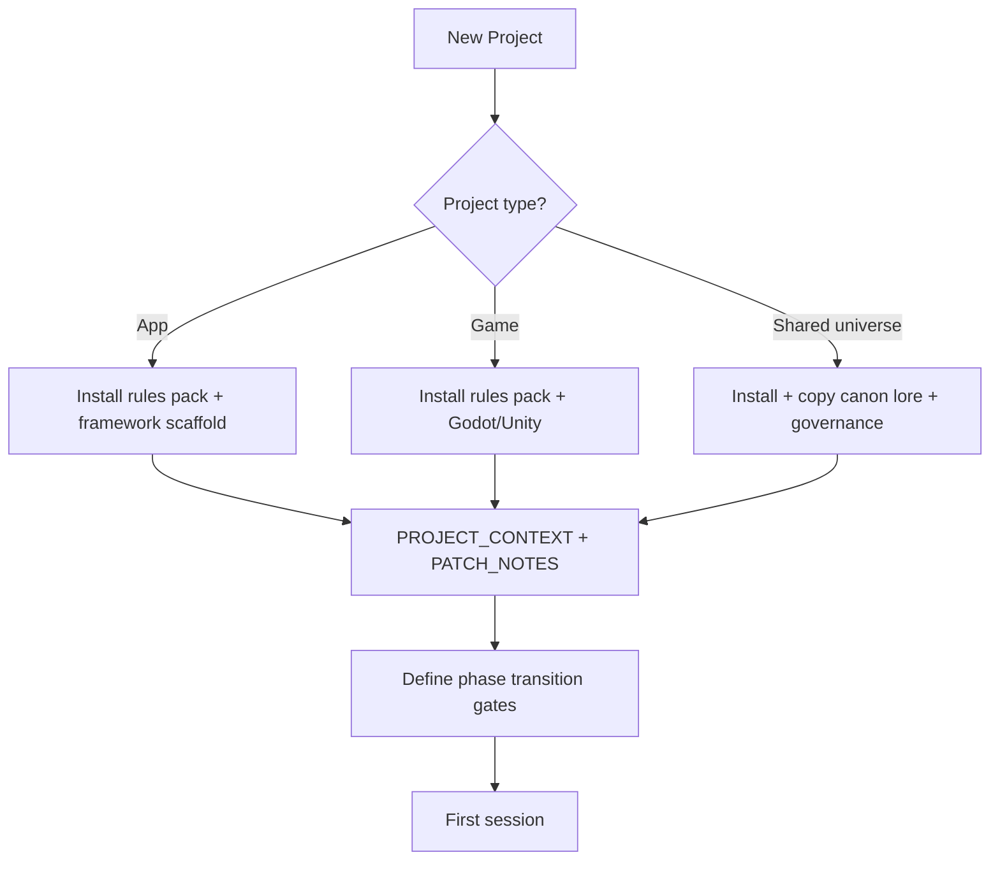

# New Project Start Master Runbook

Use this whenever you start a new project. Follow top to bottom. Branch only where project type requires it.

**Parallel non-commercial / passion projects** (long-horizon hobby repos that do **not** compete with the primary pipeline): follow the same git + rules-pack mechanics below, but apply your workspace's own scheduling and priority rules for hobby work — so they stay backed up and findable without being confused for the next shipping product.

---

## Phase 0 — When to Start

- **Authority:** Which project is next, and whether a new primary build may start, is decided by the project queue in your workspace's governing records (project pipeline / portfolio authority) — never by this runbook. Consult those records first; this document never infers or assigns a primary build.
- **Rule:** Do not start a new **primary** build until the current one hits its agreed gate (or you have explicit capacity confirmed against the portfolio authority).
- **Planning window:** 2–4 weeks before build start — lock scope, run planning gates, and run any pool/priority comparison your governing records call for.

---

## Phase Transition Gates (When to Start Each Phase)

Every project needs explicit gates for when to move from one phase to the next — **within** the current project and **across** projects.

### Within a project (current project's phases)

| Gate | When to proceed | Action before starting next phase |
|------|-----------------|-----------------------------------|
| Phase 1 complete → Phase 2 | All Phase 1 checklist items done; device test passed | Run phase postmortem; run rule upgrade pass; run `rules:pack:verify` if pack rules changed; mark phase COMPLETE in ROADMAP_TIMELINE |
| Phase 2 complete → Phase 3 | Same pattern | Same |
| Phase N complete → Phase N+1 | Same pattern | Same |

### Across projects (when to start the next project's phases)

| Gate | When to proceed | Action |
|------|-----------------|--------|
| **Current primary → vertical slice** | Playable core loop exists; at least one external playtest or demo done | Open **planning window** (2–4 weeks); run the pool/priority comparison defined in your governing records; select next pre-production project |
| **Next project pre-production** | Planning window complete; next project selected per the portfolio authority | Create repo; install rules pack; run planning gates; lock scope; no build yet |
| **Next project Phase 1** | Current primary has **shipped** (or the portfolio authority explicitly grants parallel capacity) | Start building; follow Phase 1 checklist in new project's ROADMAP_TIMELINE |
| **Next project Phase 2, 3, etc.** | Previous phase of that project is complete | Same as "within project" gates above |

**Rule:** Define these gates in `docs/ROADMAP_TIMELINE.md` and in `docs/PHASE_TRANSITION_GATES.md` at project start (the install writes `PHASE_TRANSITION_GATES.md` from the pack template).

---

## Phase 1 — Create the Project (First-Time Friendly)

### 1a. Decide project type

- App (Expo/React Native, web)
- Game (Godot, Unity, etc.)
- Other (specify)

### 1b. Create local folder

- Example: `<PROJECT_PATH>` (e.g. a folder named after your project, inside your workspace)
- Place the new repository inside its approved role folder (studio, partner, personal, experiment, later, tool, or reference — see `00-START-HERE.md` at the workspace root for the current folder map). Do not nest it inside another project's repository.

### 1c. Initialize Git (if new project)

- Open terminal in the new folder.
- Run: `git init`
- Add a `.gitignore` before first commit — copy from a similar project or framework default.

### 1d. Create GitHub repo (required for all future projects)

1. Go to github.com and sign in.
2. Click the **+** in the top-right, then **New repository**.
3. **Repository name:** Match your folder (e.g. `<project-name>`). Use lowercase, hyphens for spaces.
4. **Description:** Optional one-line summary.
5. **Visibility:** Private (recommended) or Public.
6. **Do NOT** check "Add a README file" — you already have or will add local files.
7. **Do NOT** add .gitignore or license yet; add these locally.
8. Click **Create repository**.
9. Copy the "push an existing repository" command: `git remote add origin https://github.com/YOUR_USERNAME/<project-name>.git` — replace YOUR_USERNAME and `<project-name>`.
10. After your first commit: `git push -u origin main` (or `master` if that's your default branch).

### 1d.1 Recommended Git setup (every new project)

- Ensure Git is configured: `git config --global user.name "Your Name"` and `git config --global user.email "your@email.com"`.
- Add `.gitignore` before first commit.
- First commit: `git add .` → `git commit -m "Initial commit: project scaffold + rules pack"` → `git push -u origin main`.

### 1e. Add project scaffolding (framework-specific)

- **Godot:** Create new Godot project in that folder (File → New Project) or clone a starter.
- **Expo:** `npx create-expo-app@latest .` (run in folder).
- **Web (Vite):** `npm create vite@latest . -- --template react` (or similar).
- **Blank:** Leave folder empty — install will create `.cursor/rules/` and `docs/`.

---

## Phase 2 — Install Rules Pack (From Project Starter)

**Project Starter is the tooling authority for the rules pack.** Find its current location via `00-START-HERE.md` at the workspace root — do not rely on a memorized path, as the workspace layout can change. The pack at `starter/rules-pack/` inside Project Starter is maintained directly — there is no generation or build step. Verify it, then install it.

### 2a. Verify the pack

- Open a terminal in the Project Starter repository (location per `00-START-HERE.md`).
- Run: `npm run rules:pack:verify`
- Confirm output: "Rules-pack verification passed."

### 2b. Install into new project

- Run: `npm run rules:pack:install -- "<PROJECT_PATH>"` (your new project's exact path)
- Wrap the path in quotes if it has spaces.
- Confirm output: "Rules pack install complete."

### 2c. Initialize this week

- If the new project has `package.json` with `ops:week:init`: `cd` to the new project and run `npm run ops:week:init`.
- Otherwise, run from the Project Starter terminal: `node scripts/init-weekly-ops.js "<PROJECT_PATH>"`
- This appends the current week scaffold to `WEEKLY_EXECUTION_TRACKER.md` and `ACCOUNTABILITY_AUDIT_LOG.md`.

### 2d. Verify

- Open the new project in Cursor.
- Confirm: `.cursor/rules/` exists, `docs/WEEKLY_EXECUTION_TRACKER.md`, `docs/ACCOUNTABILITY_AUDIT_LOG.md`, `docs/ROADMAP_TIMELINE.md`, `PROJECT_CONTEXT.md`, `PATCH_NOTES.md`.

---

## Phase 3 — Planning Gates (Before Writing Code)

### 3a. AI tooling matrix

- Lock: AI intensity (high assist / hybrid / low assist).
- Lock: Tool by phase (planning, prototype, vertical slice, pre-release).
- Lock: Human-owned outputs by phase.
- Lock: Replacement plan if tool underperforms.
- Add to `docs/DECISION_LOG.md` or `PROJECT_CONTEXT.md`.

### 3b. New project planning matrix

- Fill in: Primary AI tool(s), human owner, quality gate, fallback for each phase.
- Rule: If this matrix is not defined, planning is incomplete.
- Reference material: `AI_FIRST_BUILD_STRATEGY.md` (reference-only content in the Project Starter pack, `starter/rules-pack/docs/` — not installed automatically; read it at the source).

### 3b.1 Set up automated testing framework

Lock the test framework before writing any logic code. This is non-negotiable — tests added after the fact are incomplete and miss edge cases.

| Project type | Framework | Install command | Run command |
|---|---|---|---|
| Expo / React Native | Jest (ships with Expo) | None needed | `npm test` |
| Electron / React | Jest | `npm install --save-dev jest` | `npm test` |
| Godot | GUT plugin | Install from Godot Asset Library | GUT panel in editor or `godot --headless -s addons/gut/gut_cmdln.gd` |

**Rule:** The test framework must be confirmed working (run once, even with an empty test) before Phase 1 build work begins. Log the choice in `docs/DECISION_LOG.md`.

### 3c. Scope and roadmap

- Fill `docs/ROADMAP_TIMELINE.md` Section A (day-one snapshot) and Section B (master timeline).
- Define phases and must-ship items.
- Fill `docs/PHASE_TRANSITION_GATES.md` (written by the install from the pack template).

---

## Phase 4 — Project-Type Add-Ons

### 4a. All projects

- `PROJECT_CONTEXT.md` and `PATCH_NOTES.md` are installed by the rules pack. Customize them.
- Review the installed `.cursor/rules/` for rules that don't fit this project's type or content standards; remove or replace them with project-appropriate versions.

### 4b. Shared-universe / franchise projects

- If this project belongs to a shared story universe, copy the universe's canonical lore and governance documents from wherever that universe's canon home is (see your workspace's governing records for the canonical location), and declare which canon entries this project uses. New lore follows the universe's own promotion rules.

### 4c. Game projects

- Consult `RESEARCH_ZERO_RUNTIME_GAMES_2026.md` and `AI_FIRST_BUILD_STRATEGY.md` — reference-only content in the Project Starter pack (`starter/rules-pack/docs/`), not installed automatically.
- Add game-specific rules (build discipline, asset pipeline) if needed.

### 4d. Project-type flow diagram (quick reference)

---

## Phase 5 — Session Protocol Customization

### 5a. Replace session-protocol (if using template)

- If the rules pack includes `session-protocol-template.mdc`, copy/rename to `session-protocol.mdc`.
- Replace `<PROJECT_PATH>` with your repo path.
- Add project-specific steps; remove template steps that don't apply to this project (e.g. environment checks for services this project doesn't use).

### 5b. Update workflow-rulesheet

- If it references `<PROJECT_PATH>` or another project's specifics, update it for the new project.

---

## Phase 6 — First Session

- Open new project in Cursor.
- Start a new chat.
- Say: "Run entry checklist" or "New session — run the full checklist."
- Confirm rules are loaded and first briefing appears.
- Set this week's planned hours in `docs/WEEKLY_EXECUTION_TRACKER.md`.
- Define one must-ship item for the week.

---

## Loose Ends / FAQ

| Question | Answer |
|----------|--------|
| Do I need to create the folder before install? | Yes. The install script needs the target path to exist. |
| Can I install into an empty folder? | Yes. Install creates `.cursor/rules/` and `docs/`. |
| What if I already have a docs/ folder? | Install writes missing files. Existing files are preserved; the incoming version is written to a `.template.md` copy instead. |
| Do I need GitHub? | Yes — required for all future projects. |
| Where do I run `npm run rules:pack:install`? | From a terminal in the Project Starter repository — find its current location via `00-START-HERE.md` at the workspace root. |
| The new project has no package.json — how do I run ops:week:init? | Run from the Project Starter terminal: `node scripts/init-weekly-ops.js "<PROJECT_PATH>"` |
| Do I need to run rules:pack:build before installing? | No — that step is deprecated. The pack at `starter/rules-pack/` is maintained directly with no generation step. Run `npm run rules:pack:verify` instead to confirm the pack is valid before installing. |
